## Origins of Poppy

 

   <ol>
            <li>Need to experiment <strong>morphological variations</strong></li>
            <li>Need to experiment in the <strong>real world</strong> (not a physical simulator)</li>
            <li>Need to have <strong>reproducible</strong> work for scientific community</li>
        </ol>
 

 

       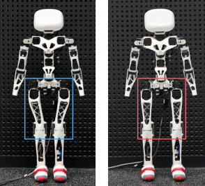

 

Note:
Poppy is a platform made for exploring morphology. We wanted to consider the morphology as an experimental variable and be able to change it easily.
If we want to change an arm or a leg it is made to be pretty easy and can be done quickly.

It's common to make experiments on a simulator. But we wanted to be also able to experiment on the real world, with true dynamics, gravity, and friction because this are things very hard to model, and the results may be far different the reality .
Moreover as scientist and now for education it is very important to make experiments reproducible for scientific community. 

--new--

<!-- .slide: data-background-video="../video/poppy_start.mp4" data-background-color="#000000"  -->

Note:
We've made this video at the beginning of the poppy-project to present our first robot, poppy humanoid.
Poppy humanoid has been made for exploring morphology and biped locomotion.
<!-- The poppy platform is made for scientists, artists and education
All its shape are 3D printed. -->

The black boxes are its motors. It owns 25 motors, a LCD screen for the eyes, two cameras, an embedded computer for controlling motors and high level comportments, and some other sensors. It's trunk is multi-articulated 

<!-- poppy humanoid.
open source
White shape is 3D printed
black boxes are motors.  -->

--new--
<!-- .slide: data-background-video="../video/poppy_time_lapse.mp4" data-background-color="#000000"  -->

Note:
Assemble a Poppy Humanoid look like this.
You first need to collect all its part. For that, you have to buy the motors, wires and screws.3D Print yourself in a fablab or make it print all the plastic shapes.
And after that you'll have to assemble it. To assemble it you just need a screwdriver and a couple of days ahead. It's made to be easy to mount, it doesn't need more knowledges than assemble an IKEA furniture. 
We're used to say it's like Meccano for adults.

--new--
## Technology stack
Poppy platform is thought to __learn__, __create__, __experiment and be hacked!__

 

   <h4> Software </h4>
   

 <h4> Mechanical  </h4>
 <video autoplay loop data-autoplay src="../video/poppy_print_timelapse.mp4"></video>

  <h4> Electronic  </h4>
  
  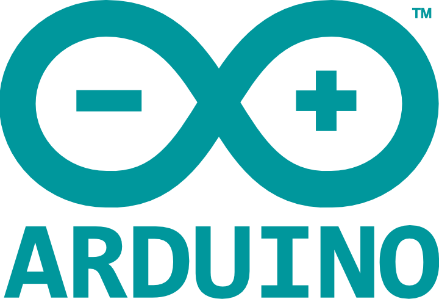

Note:
The poppy project has been made to be easy to use and modify. For that its based on popular technologies.

The beginning of the project came with the democratisation of 3D print which allow us to make fast iterations on conception and production of new parts.

The software is based on a python library, Pypot. The Electronic is based on arduino and raspberry Pi. Both of them are affordable and popular for their low learning curve, which is very important for the democratisation of the platform.

--new--

## Open source

 

   <h4>  </h4>
   
   <ul> 
     <li>__Mechanic__ (OpenScad, Solidworks) </li> 
     <li>__Electronic__ (Kikad, Eagle) </li> 
   </ul> 
 

 

   <h4>   </h4>
   
   <ul> 
     <li>__Motor control__ (pypot) </li> 
     <li>__High level controls__ (specific to the poppy creature) </li> 
   </ul> 
 

https://github.com/poppy-project/pypot
Note:
The Poppy project intend to be a community project.
For this purpose all our work on electronic  mechanic and software is open source and can be download, modified and redistributed.
--new--
<!-- .slide: data-transition="none"-->
## A family of robots

Note:
As we intended to make the platform easy to modify, the poppy family has quickly expanded.
--new--

<!-- .slide: data-transition="none"-->
## A family of robots
Poppy Humanoid :

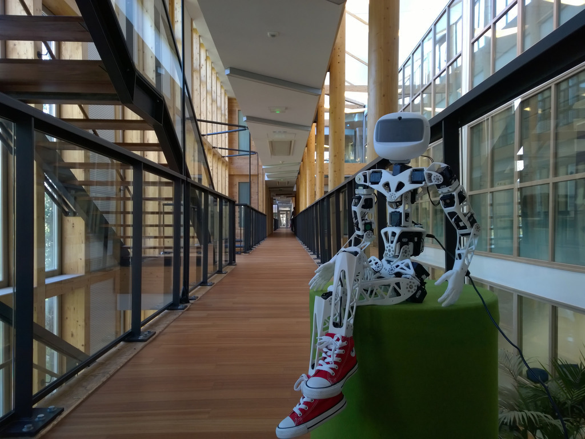
Note:
The initial robot

--new--

<!-- .slide: data-transition="none"-->
## A family of robots
Poppy Humanoid  modified:
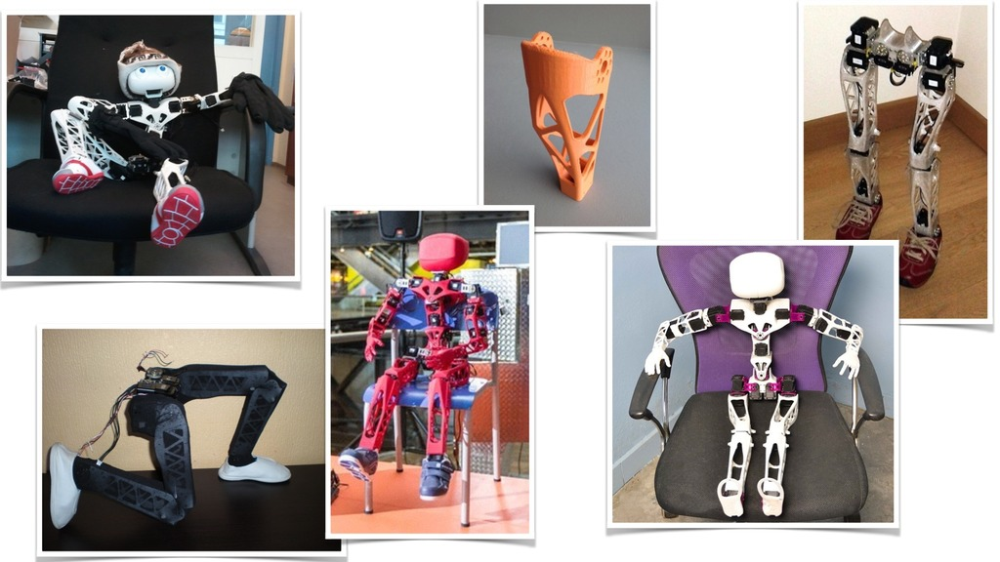
Note:
And some of its morphological modifications
--new--
<!-- .slide: data-transition="none"-->
## A family of robots
Poppy Torso:

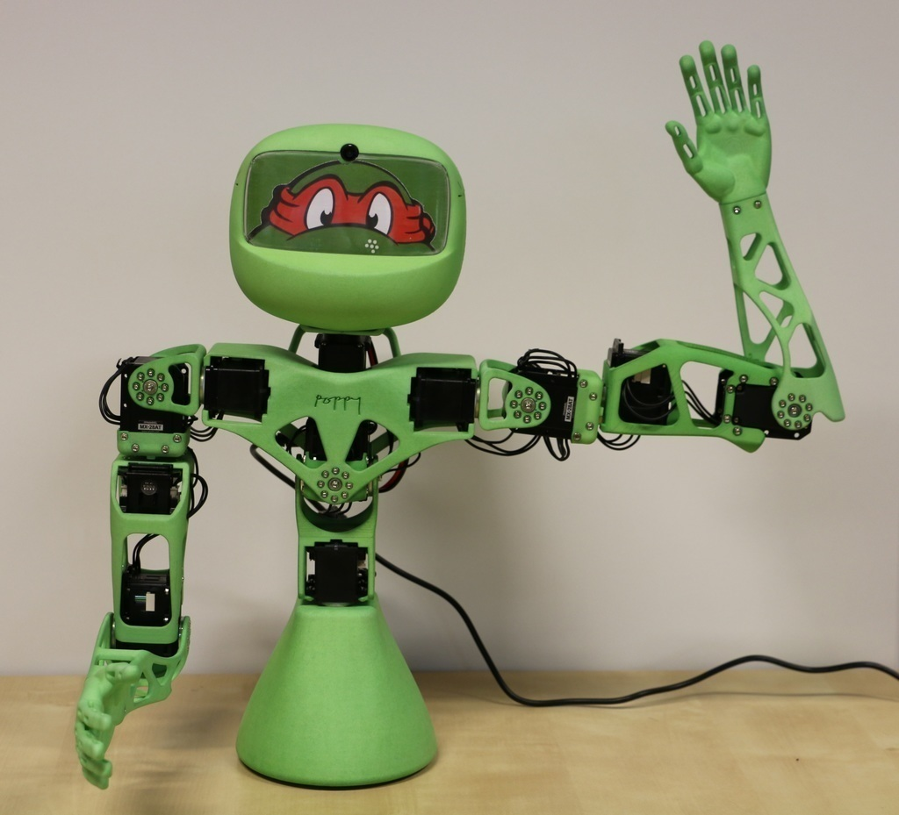
Note:
Quickly after poppy humanoid was made poppy torso.
It is poppy humanoid without its legs and with a suction disc to maintain the on the table. If you doesn't need to explore locomotion, the it's easier to use than the humanoid because it's avoid all the stabilisations issues of the humanoid. As the main cost of the robot comes from the motors, by halving the number of motors, it approximately halving the cost of the robot, which makes it more affordable.

<!-- ## A family of robots
Poppy Ergo:

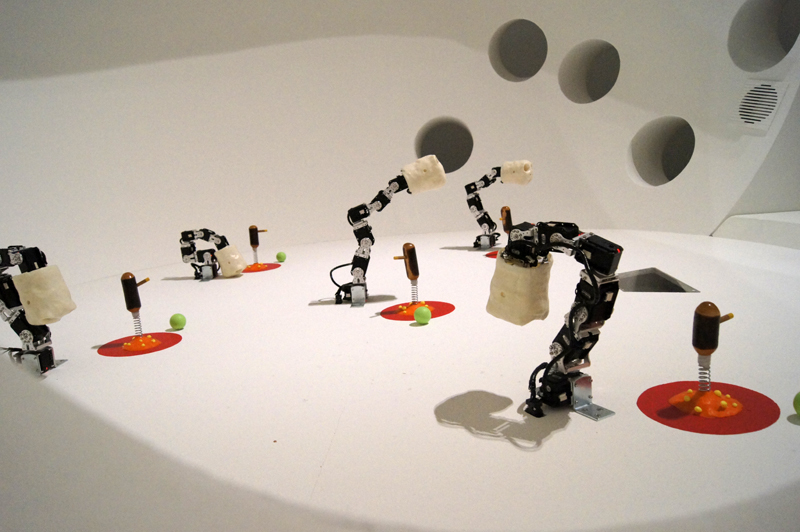
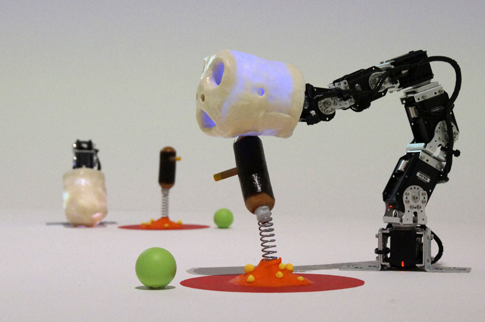 -->

--new--
<!-- .slide: data-transition="none"-->
## A family of robots
Poppy Ergo Jr:

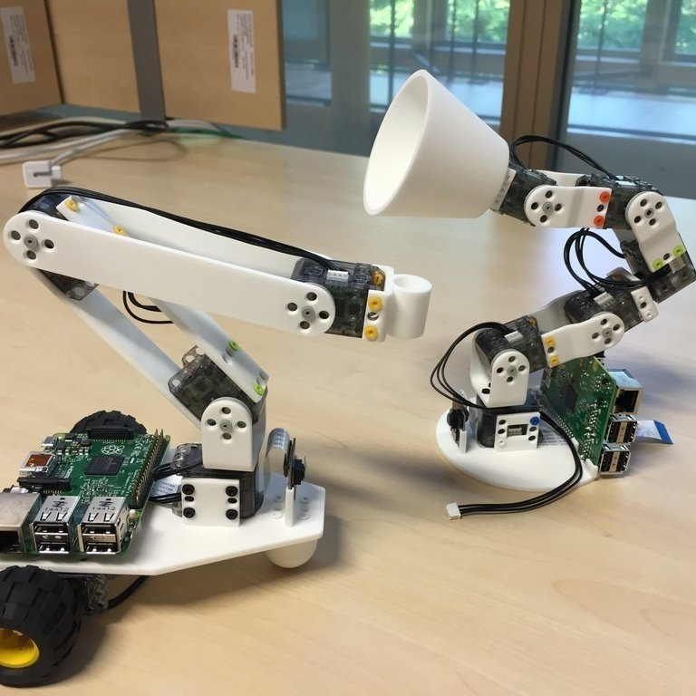

Note:
The last robots made in our lab are poppy-ergo jr.
These creatures use the same brand of motors than the poppy-torso and humanoid but in a smaller version. We can put as raspberry pi and a camera on the base of the robot.

You can maybe recognize the jump of the pixar lamp which influence us for the shape of these robots.

--new--

## Used for _science_, _art_ and _education_
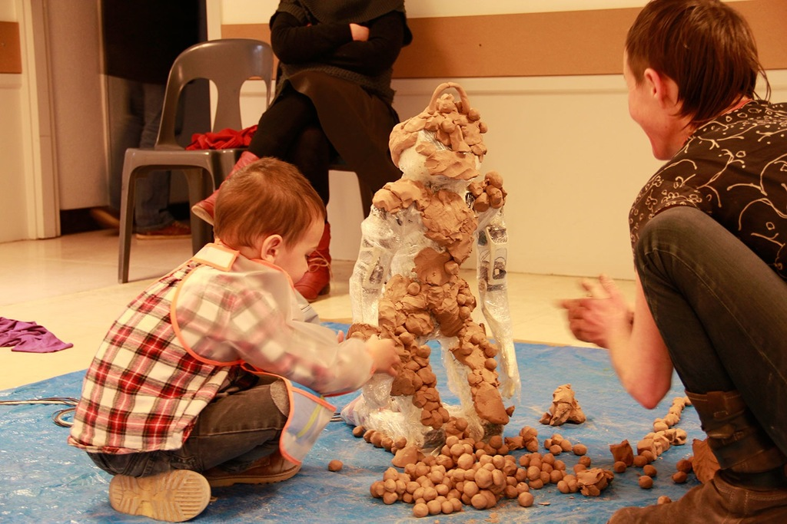
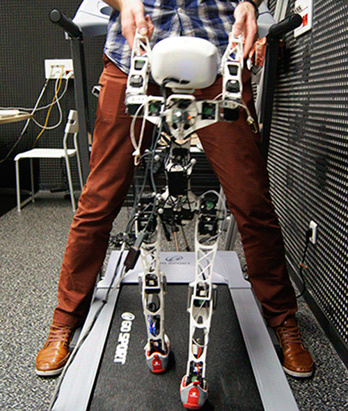
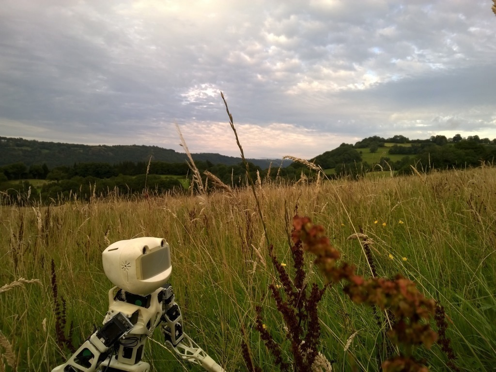

Note:
As I previously explained, poppy was originally made for science. But some projects have been developed in art and education. The following part of the presentation will be related to education usages of a Poppy robot. 

--new--
## Education ... a beginning
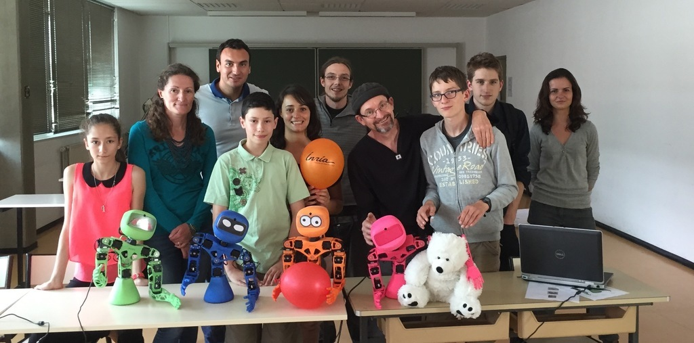
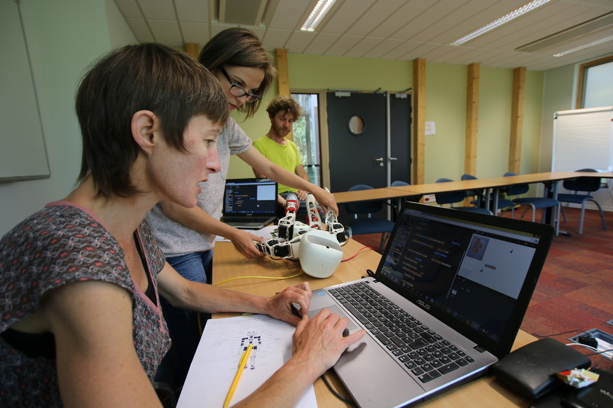

Note:
Few month ago we received a grant for developing educational activities with the poppy platform and we will be able to hire 4 peoples on full time on the project. 

We already started to make some experiments with educational activities, but keep in mind that this is its early stages of development.

--new--
## _Snap!_ 
GUI for learning and playing nested movements
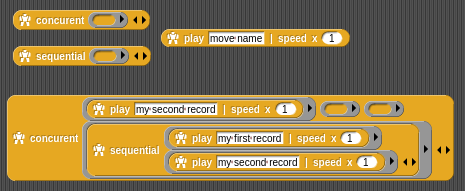

Mixing movements learnt thanks to Gaussian Mixture

Note:
We have implemented in Snap! most of high level poppy robot controls, which allow users to use it as a complete language for programming robots on Poppy platform.
A very interesting part of using Snap! is for recording movements of the robot manipulated by users. We call it playing by demonstration.

Thanks to functional programming we can play movements learnt by demonstration concurrently and sequentially as nested as we want. It allows users to program quickly by demonstration very complex movements.

Snap! is very interesting for educational purposes, but it can also be used as a powerful GUI for scientific projects. <!-- It can be use for making fast prototyping for recording --> 

<!-- Snap! is  -->

