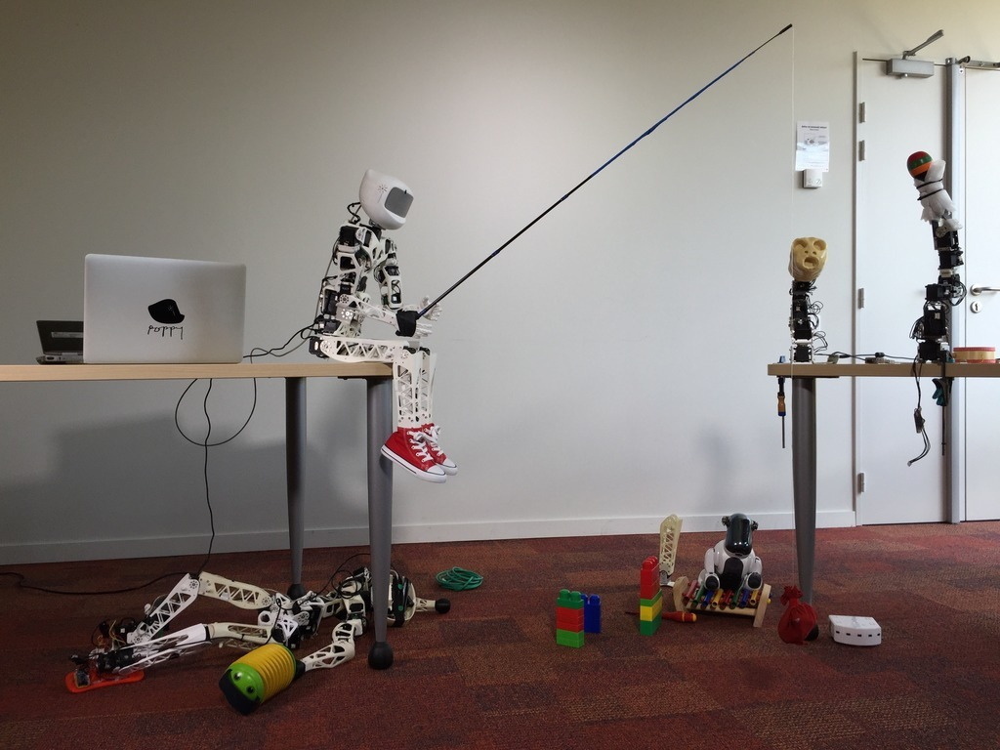

## Origins of Poppy

 

   <ol>
            <li>Need to experiment <strong>morphological variations</strong></li>
            <li>Need to experiment in the <strong>real world</strong> (not a physical simulator)</li>
            <li>Need to have <strong>reproducible</strong> work for scientific community</li>
        </ol>
 

 

       

 

Note:
Poppy is a platform made for exploring morphology. We wanted to consider the morphology as an experimental variable and be able to change it easily.
If we want to change an arm or a leg it is pretty easy and can be done quickly.

It's pretty common to make experiments on a simulator. But we wanted to be able to experiment on the real world, with true friction, dynamics, and gravity.
Moreover as scientist and now for education it is very important to make experiments reproducible. 

--new--

<!-- .slide: data-background-video="video/poppy_start.mp4" data-background-color="#000000"  -->

Note:
Poppy humanoid is the first robot we've made for exploring morphology and biped locomotion.
The poppy platform is made for scientists, artists and education
All its shape are 3D printed.
The black boxes are its motors. It owns 25 motors, a LCD screen for the eyes, two cameras, an embedded computer for controlling motors and high level comportments, and some other sensors. It's trunk is multi-articulated 

<!-- poppy humanoid.
open source
White shape is 3D printed
black boxes are motors.  -->

--new--
<!-- .slide: data-background-video="video/poppy_time_lapse.mp4" data-background-color="#000000"  -->

Note:
Assemble a Poppy Humanoid look like this.
You first need to collect all its part. For that, you have to buy the motors, wires and screw. Print yourself in a fablab or make it print all the plastic shapes.
To assemble it you just need a screwdriver and a couple of days ahead. It's made to be easy to mount, it doesn't need more knowledges than assemble an IKEA furniture. To resume, it's like Meccano for adults.

--new--
## Technology stack
Poppy platform is thought to __learn__, __create__, __experiment and be hacked!__

 

   <h4> Software </h4>
   

 <h4> Mechanical  </h4>
 <video autoplay loop data-autoplay src="video/poppy_print_timelapse.mp4"></video>

  <h4> Electronic  </h4>
  
  

Note:
The beginning of the poppy project came with the democratisation of 3D print which allow us to make fast iterations on the conception and production of new parts.
The software is based on a python library, and the electronic on arduino and raspberry Pi. The both are affordable and popular for their low learning curve, which is very important for the democratisation of the platform.

--new--

## Open source

 

   <h4>  </h4>
   
   <ul> 
     <li>__Mechanic__ (OpenScad, Solidworks) </li> 
     <li>__Electronic__ (Kikad, Eagle) </li> 
   </ul> 
 

 

   <h4>   </h4>
   
   <ul> 
     <li>__Motor control__ (pypot) </li> 
     <li>__High level controls__ (specific to the poppy creature) </li> 
   </ul> 
 

https://github.com/poppy-project/pypot
Note:
The Electronic, mechanic and software are open source and can be download and modified on GitHub.
--new--
<!-- .slide: data-transition="none"-->
## A family of robots

--new--

<!-- .slide: data-transition="none"-->
## A family of robots
Poppy Humanoid :

--new--

<!-- .slide: data-transition="none"-->
## A family of robots
Poppy Humanoid  modified:

--new--
<!-- .slide: data-transition="none"-->
## A family of robots
Poppy Torso:

--new--
<!-- .slide: data-transition="none"-->
## A family of robots
Poppy Ergo:

--new--
<!-- .slide: data-transition="none"-->
## A family of robots
Poppy Ergo Jr:

--new--

## Used for _science_, _art_ and _education_

Note:

--new--
## Education

Note:
Example of a workshop
Transition live coding

