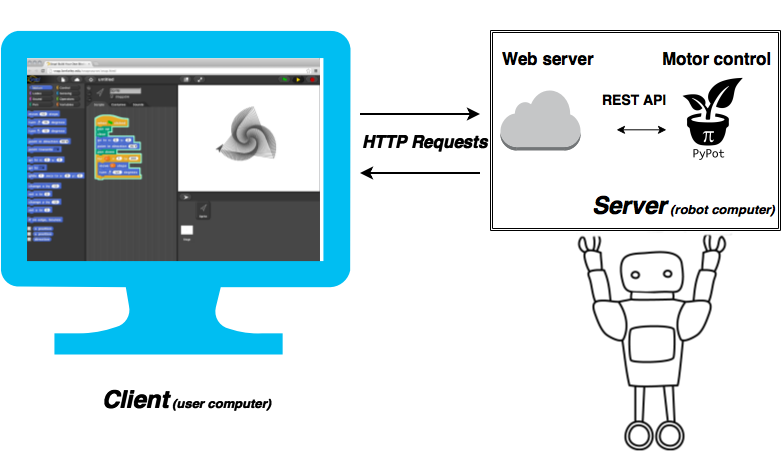
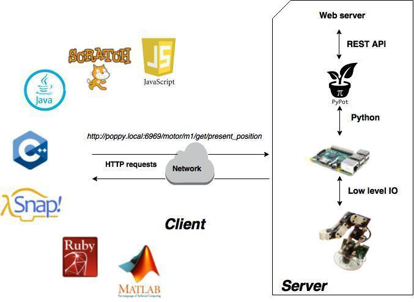
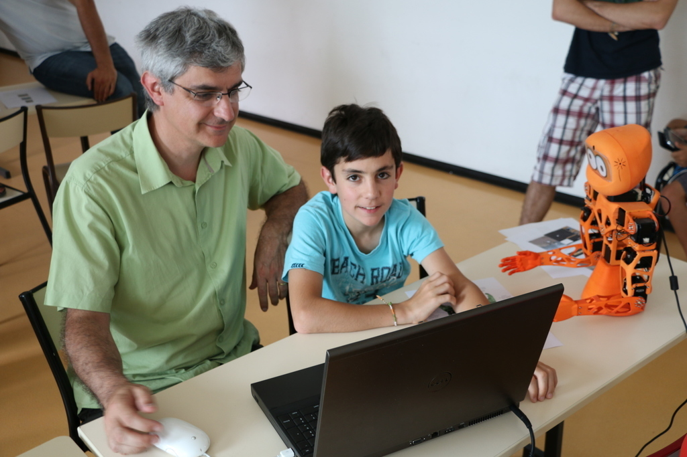

# Live coding !
Note:
I'll now show you some of things we can do with Snap! and a Poppy Robot.

--new--
<!-- .slide: data-background-video="../video/poppy_maracas.webm" data-background-color="#000000"  -->
Note:
As we as very a serious research lab, it one the experience somebody made by combining learning by demonstration.

--new--
## Integration of _Snap!_ with pypot

Note:
How to make control poppy creature from Snap! ?
A small computer is located on the robot head. This computer is controlling the robot motors, but its also host a web server which allow us to remotely control the robot by making HTTP requests on it.
Snap! which is loaded on the user web browser is making http requests to the robot server when users are executing a block.
   

<!-- 
Allow to use other programming languages

 -->

--new--

## Integration of _Snap!_ with pypot
### Simply use the HTTP block

Note:
We are just using the snap http block, on a crafted URL corresponding to API on the robot web server.

--new--
## Poppy Education
* __January 2016__: beta tests on 9 high schools near Bordeaux
* __User studies__ will be made 

Note:
As I previously said, the Flowers Lab has recently received a grant for developing educational activities with poppy project. 
Two people will be dedicated to create educational content for poppy-torso and poppy-ergo jr.
This contents will be tested and improved with users on 9 high high schools near Bordeaux  at the beginning of the next year.
Moreover a big research challenge will be to make user studies for measuring the educational impact on learning skills of students. 
--new--

## Future work with _Snap!_
Integration of a web "simulator" with Three.js (WebGL)
<video autoplay loop data-autoplay src="../video/ergo_threejs.mp4"></video>

<!-- <iframe data-src="websites/simulator/simulator/index.html" witdh="800px" height="600px"></iframe> -->

Note:
Nowadays, we can use V-REP, a robotic simulator to make simulations of our robots. But it's very annoying to use V-REP with Snap! because it needs to be installed on the computer, and it loose the great advantage of Snap! of being portable. As a side project we are working on integrating a simulator in web browsers thanks to the three.js library. We think to integrate it on the Snap! sprite interface for a better user experience !

--new--

## Thank you for your attention
### Questions?
#### __[Théo Segonds & Pierre Rouanet][website]__  __[@poppy_project][twitter]__
__[http://poppy-project.com][website]__

INRIA Flowers Team

[website]: https://poppy-project.org
[twitter]: https://twitter.com/poppy_project

--new--

## Why using _Snap!_
* __Web__ technologies (HTML5 + JS)
* Easily build your own blocks
* Advanced programmation concepts (lambda calcul)

--new--
### An active community
https://forum.poppy-project.org

--new--

## Vocabulary
* *Pypot*: python software library for motors control
* *Poppy*: name of the robotic platform used 
* *Poppy creature*: a robot build or run with the poppy platform
* *Poppy humanoid*: an humanoid robot made with the poppy platform. It was originally called simply poppy.

--new--

## Who's working on Poppy ?
* *Mathieu Lapeyre*: mechanics
* *Nicolas Rabault*: electronics
* *Pierre Rouanet*: software

... and some interns students !