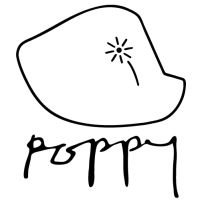

# _Snap!_ for Poppy
### __[Théo Segonds & Pierre Rouanet][website]__  __[@poppy_project][twitter]__
__[http://poppy-project.org](https://poppy-project.org)__

INRIA Flowers Team

[website]: https://poppy-project.org
[twitter]: https://twitter.com/poppy_project
Note:
Hi, I'm Théo Segonds, A master intern at Flowers lab in INRIA. I'm here with my internship supervisor, Pierre Rouanet. I'll present you the poppy project, a robotic platform made for research art and education, and how to connect a Poppy robot to Snap!.

I'll first present you the FLowers Lab and the Poppy Project, and after I'll show you a demonstration of what we can do with Snap! and a poppy robot. 

--new--
## Flowers Laboratory
### Developmental robotics
<!-- #### Constructing robots inspired by animal development -->

Note:
A project team at INRIA Bordeaux and ENSTA Paris. The main research field of the lab is about developmental robotics.
Developmental robotics is a scientific field which aims at studying mechanisms and architecture that allow learning of new skills and new knowledges in embodied machines. 

Three Years ago, as part of Matthieu Lapeyre thesis on biped locomotion, we needed a robot that allow us to explore morphology. This is how the poppy project is born

<!-- For understanding body interactions for biped locomotion, 
Constructing machines and robots, inspired by animal cognitive development, and capable of lifelong development, adaptation and interaction with the physical and social world.
such as the speech or the sensorimotor space.
.
morphology -->
